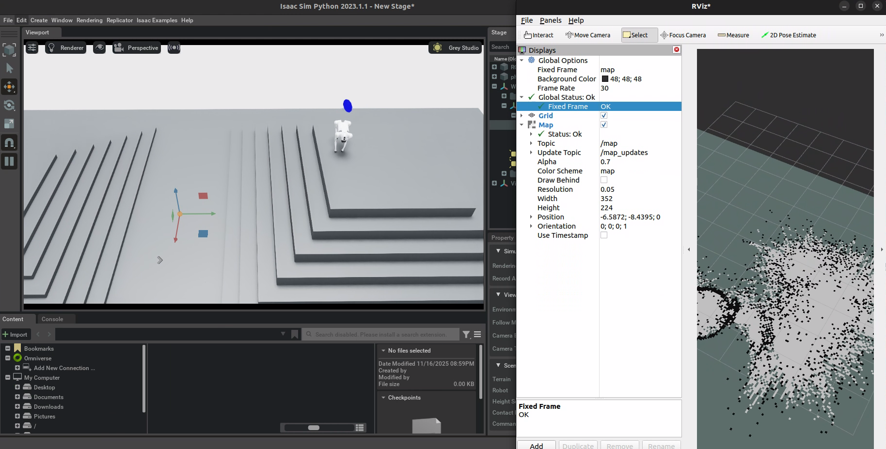

  
   <em>SLAM Toolbox running on Unitree Go2 inside IsaacSim (ROS2)</em>

# go2_slam_patch

ROS2 package that enables SLAM Toolbox to work correctly with:
- Isaac Sim 2023.1.1
- Go2 robot model from go2_omniverse
- Raw LIDAR PointCloud2 published in /robot0/point_cloud2

## What it does

✔ Fixes missing TF between base_link and LIDAR
✔ Rewrites PointCloud2 frame_id and timestamp
✔ Runs pointcloud_to_laserscan
✔ Launches slam_toolbox (async mode)

## Launch

    ros2 launch go2_slam_patch go2_slam.launch.py

## Dependencies

- slam_toolbox
- pointcloud_to_laserscan
- tf2_ros
- rclpy
- sensor_msgs

Tested on:
Ubuntu 22.04 + ROS2 Humble + IsaacSim 2023.1.1
